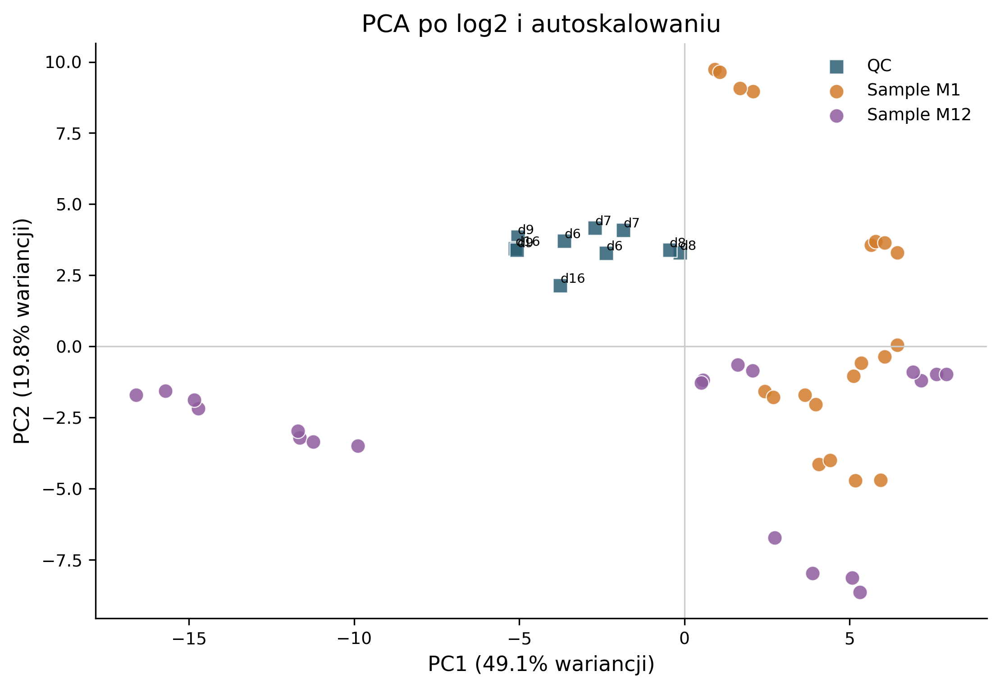
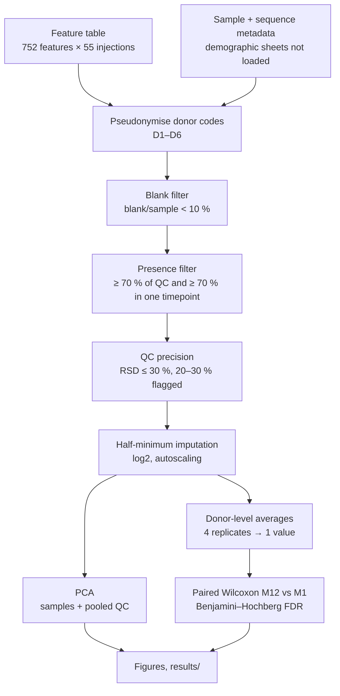
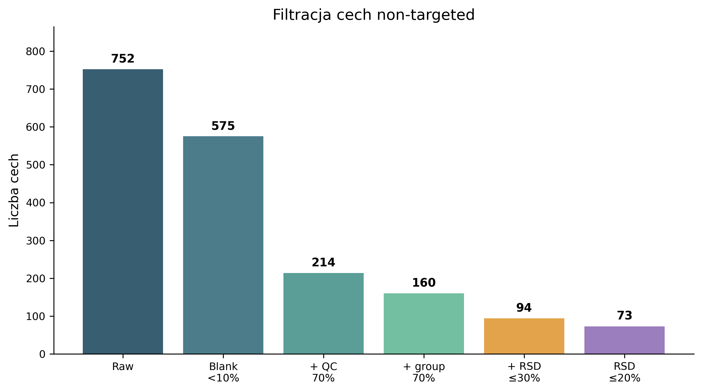
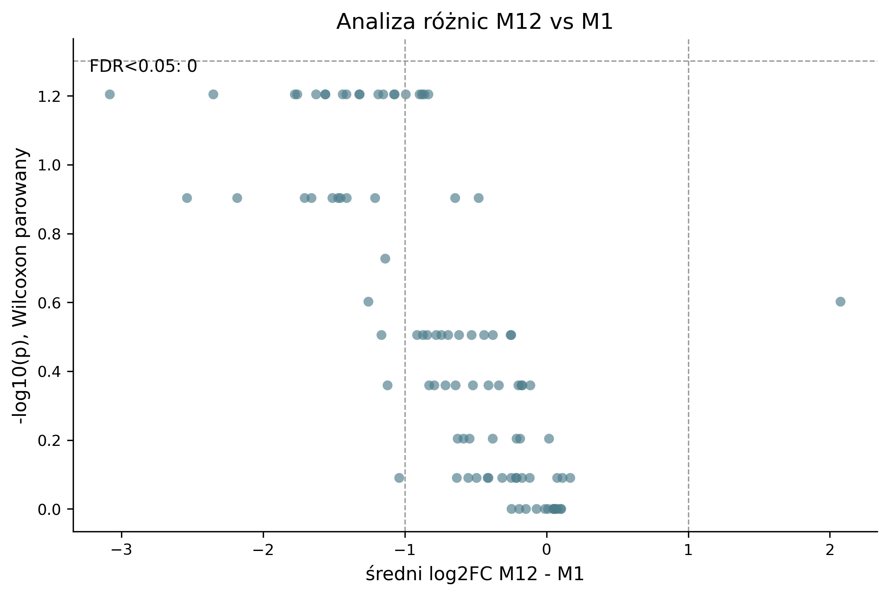

# Untargeted LC-MS lipidomics of human milk: month 1 vs month 12 of lactation

[](https://github.com/setsun-ai/lipidomics-human-milk-untargeted/actions/workflows/ci.yml)

**MSc coursework.** A Python workflow that turns an untargeted LC-MS feature table into QC-filtered, statistically tested results. It is applied to a paired study of human milk lipids at months 1 and 12 of lactation.



## Context & motivation

Untargeted lipidomics measures thousands of LC-MS features at once. Before any biology, the data need careful quality control: features that also appear in the extraction blank, that are missing in most samples, or that drift across pooled-QC injections are analytical noise, not biology.

The project practised designing that preprocessing and then testing a biological question honestly: does the milk lipid profile change between the first and the twelfth month of lactation? Both steps are routine in metabolomics and lipidomics work in biomarker and nutrition research.

The key point is the statistics. The design is paired (the same donor at both timepoints) and has only 5 donors. Treating the 40 injections as independent samples (pseudoreplication) would inflate significance, so the tests are done on donor-level averages.

## Study design and data

- **Design:** longitudinal and paired. 5 donors, each sampled at lactation month 1 (M1) and month 12 (M12).
- **Replicates:** 2 biological × 2 extraction replicates per donor and timepoint, giving 40 sample injections.
- **Controls:** 10 pooled-QC injections across 5 measurement days, plus 1 extraction blank. One further donor had no M1 samples and is excluded.
- **Input:** untargeted LC-MS feature table (752 features) and a metadata workbook. **Restricted, not published** (see [DATA_AVAILABILITY.md](DATA_AVAILABILITY.md)).

## Method



## Key results

| Step | Features |
|---|---|
| Raw feature table | 752 |
| After blank filter (< 10 %) | 575 |
| + ≥ 70 % QC presence + ≥ 70 % presence in a timepoint | 160 |
| **Final: QC RSD ≤ 30 %** | **94** |
| Strict subset: QC RSD ≤ 20 % | 73 |

- **Analytical quality:** pooled QCs cluster tightly in the PCA, which indicates a stable analytical series.
- **Biological signal:** M1 and M12 samples partly separate along PC1 + PC2 (49.1 % + 19.8 % of the variance), mostly within donor pairs.
- **Statistics:** no feature reached FDR q < 0.05 in the paired Wilcoxon test. With n = 5 donors the smallest possible exact two-sided p is 0.0625, so this is a power limit of the design, not evidence of no change. Candidate features ranked by fold change are in [`results/univariate_statistics_m1_vs_m12.csv`](results/univariate_statistics_m1_vs_m12.csv).

<p>


</p>

## Validation & limitations

- Features are not annotated as lipid species (no MS/MS identification), so the results are feature-level (m/z, RT).
- **5 donors:** an exact paired test cannot reach p < 0.05. The PCA separation is descriptive.
- The 20–30 % RSD features are kept but flagged. Conclusions should lean on the 73 features with RSD ≤ 20 %.
- Exact file-name mismatches between the feature table and the metadata were resolved by the inferred sample ID and logged in `results/metadata_audit_summary.json`.

## How to run

```bash
pip install -r requirements-dev.txt
pytest                      # parser, pseudonymisation and an end-to-end run on synthetic data
# with the restricted input files in input_data/:
python analysis_non_targeted.py --input-dir input_data --output-dir .
```

Steps that need the restricted data are listed in [DATA_AVAILABILITY.md](DATA_AVAILABILITY.md#4-what-can-and-cannot-be-reproduced-without-the-restricted-data). With those files, the published `results/` are reproduced byte-for-byte.

## Repository structure

```
analysis_non_targeted.py     full workflow (CLI)
analysis_non_targeted.ipynb  notebook wrapper running the same workflow
tests/                       synthetic-data tests (pytest)
figures/                     filtering waterfall, QC RSD, RT–m/z map, PCA, volcano, heatmap, signal drift
results/                     summary JSON, filtering and feature metrics, univariate stats, PCA loadings, run log
poster/                      conference poster (116 × 83 cm, Polish)
report/                      technical report (Polish)
DATA_AVAILABILITY.md         what is public, what is restricted, what is reproducible
```

## Data availability & privacy

The raw feature table and the donor metadata are **not** distributed: they are health-related data from a 5-person cohort. Only feature-level aggregates and figures are published, with donor codes replaced by neutral aliases. Details are in [DATA_AVAILABILITY.md](DATA_AVAILABILITY.md).

## Scope

- **Set by the course:**
  - the dataset (untargeted and targeted tables, metadata) and the research question M1 vs M12,
  - the menu of preprocessing variants: blank 10 %, QC presence 100 % or 70 %, sample presence variants, RSD classes ≤ 20 / 20–30 / > 30 %,
  - a conference poster (116 × 83 cm) with an oral defence.
- **My decisions:**
  - analysing only the untargeted data,
  - choosing the filter variant (70 % QC + 70 % in a timepoint, RSD ≤ 30 % with a 20–30 % flag),
  - donor-level aggregation and paired tests to avoid pseudoreplication,
  - reporting the null FDR result with its power limitation,
  - and in this repository: the data-minimising pseudonymisation, the synthetic-data tests and CI.

## AI usage

AI-assisted development was used for implementation and documentation. Method choice, validation strategy, data-handling decisions, result verification and interpretation were reviewed and owned by me. Specifically, I chose the preprocessing variant and the paired donor-level design, checked the metadata mismatches, and confirmed that the refactored script reproduces the original results byte-for-byte on the restricted data.

## License

Code: MIT (see [LICENSE](LICENSE)). The input data are not part of this repository and are not covered by this licence.

---

## 🇵🇱 Opis po polsku

Projekt z przedmiotu *Lipidomika i glikomika* (kierunek InfoBioChem, studia II stopnia, Politechnika Gdańska, 2026). To analiza non-targeted LC-MS mleka kobiecego, w której porównuję 1. i 12. miesiąc laktacji (5 dawczyń, układ sparowany).

- **Workflow w Pythonie:**
  - filtr blanku
  - filtrowanie cech na podstawie QC (obecność, RSD)
  - imputacja i transformacja log2
  - PCA
  - uśrednienie na poziomie dawczyni
  - sparowany test Wilcoxona z korektą FDR
- **Wyniki:** z 752 cech do analizy przeszły 94 (QC RSD ≤ 30 %). Żadna cecha nie osiągnęła q < 0,05, co przy n = 5 wynika z ograniczonej mocy testu.
- **Dane wejściowe nie są publikowane.** Kody dawczyń są zastępowane neutralnymi aliasami (D1–D6), a arkusze z danymi demograficznymi nie są wczytywane. Szczegóły: [DATA_AVAILABILITY.md](DATA_AVAILABILITY.md).
- **Testy:** `pytest` sprawdza cały workflow na danych syntetycznych.
- **Plakat i raport techniczny** (po polsku) są w folderach `poster/` i `report/`.

**Wsparcie AI:** kod i dokumentacja powstały z pomocą narzędzi AI. Wybór metody, strategia walidacji, decyzje dotyczące danych, weryfikacja i interpretacja wyników należały do mnie.
